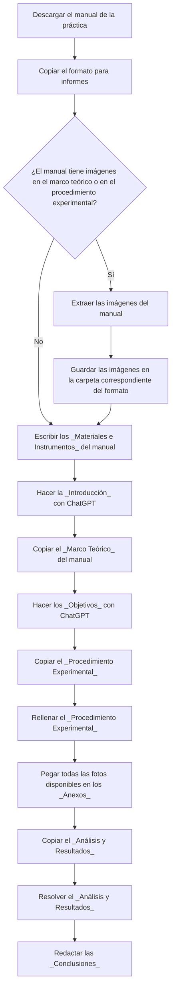

# Laboratorio de Circuitos Eléctricos I IE221

Formato de portada proporcionada [aquí](Portada.docx).

## Diagrama de flujo para redactar los informes

```mermaid
flowchart TD
    A --> B
    B --> C
    C -- Sí --> D
    D --> E
    C -- No --> F
    E --> F
    F --> G
    G --> H
    H --> I
    I --> J
    J --> K
    K --> L
    L --> M
    M --> N
    N --> O

    A[Descargar el manual de la práctica]
    B[Copiar el formato para informes]
    C{¿El manual tiene imágenes en el marco teórico o en el procedimiento experimental?}
    D[Extraer las imágenes del manual]
    E[Guardar las imágenes en la carpeta correspondiente del formato]
    F[Escribir los _Materiales e Instrumentos_ del manual]
    G[Hacer la _Introducción_ con ChatGPT]
    H[Copiar el _Marco Teórico_ del manual]
    I[Hacer los _Objetivos_ con ChatGPT]
    J[Copiar el _Procedimiento Experimental_]
    K[Rellenar el _Procedimiento Experimental_]
    L[Pegar todas las fotos disponibles en los _Anexos_]
    M[Copiar el _Análisis y Resultados_]
    N[Resolver el _Análisis y Resultados_]
    O[Redactar las _Conclusiones_]
```
